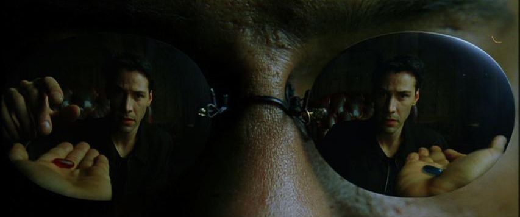

Cryptocurrency supporters are often detached from the real world problems. I've encountered people saying, that you don't need censorship resistance of blockchain for everyday purchases, because they aren't in any way subversive. Therefore it's okay if cryptocurrencies aren't suitable for those kind of activities.

For the sake of argument I'll assume it's not just a way of coping with the shortcomings of the popular p2p cash implementations like Bitcoin, but will treat it as a genuine argument in the long debate.

### Financial exlusion and violence

There are around [15 million](https://www.institutesi.org/what-is-statelessness) stateless people. They don't have any citizenship, dont have any state-given ID and there is no institution allowed to issue one. Because of that they, are denied education, healthcare, employment outsise of gray market, they can't rent an apartament and they can't have a bank account. They also can't search their luck somewhere else because they can't travel.

Did you know that up until [1974](https://www.forbes.com/advisor/banking/when-could-women-open-a-bank-account/) women in USA weren't allowed to have a bank account? Women in Saudi Arabia aren't allowed that [to this day](https://timesofindia.indiatimes.com/world/rest-of-world/ten-things-saudi-women-still-cannot-do/articleshow/64727983.cms). They also can't own a passport so they can't escape this state of affairs. 

The victims of economic violence very often have their tormentor controlling their bank account. Domestic violence perpetrators often trace their activity by the name associated with ID for years after they escape.

To all of those groups, **buying a coffee is subversive**. I recommend the article ["The rarely discussed dangers of KYC in crypto and daily life – and what you can do about it"](https://anarkiocrypto.medium.com/the-rarely-discussed-dangers-of-kyc-in-crypto-and-daily-life-and-what-you-can-do-about-it-20f2b5894439) by AnarkioCrypto for further reading.

### Blockchain is funamentally inclusive.

The core proposition of blockchain is **permissionlessness**. It means that whoever you are, you can use it. Regardless, whether you belong to an ethnic minority, in the oppressed *half* of the society (a woman), sexual minority, stateless, a religious where it's persecuted, an apostate in a confessional state, a punk, a protester, a comedian who offended the wrong politician, or an elder. You are welcome here. Well, maybe not in the crypto *communities*, I've seen them hostile and bigoted, but certainly to the protocol.

Just download the wallet, memorize or write down the key, and you can participate in the economy on the global scale. Anyone anywhere in the world can send you coins. Saudi women can secretly work for a western **feminist organizations** or receive **mutual aid**, a stateless person surely can find someone in the entire world who won't mind their unemployable status. Blockchain is about empowerment.

### It's not enough

There is a problem that unfortunately prevents it all from happening - volatility. I've participated in crypto communities that embraced the humanitarian aspect of blockchain and made it their main talking point. After a particularily deep price drop, we were discussing how awful it is, especially to the vulnerable people. The community have just done a lot of on-boarding in South Africa, promissed the people financial freedom and they have lost the little savings they had. All of a sudden someone, incidently a whale, came out and said **"THEY KNEW WHAT THEY WERE GETTING INTO"**.

It struck me as a particularily nasty thing to say. There is an insidious equivocation hidden within the **financial freedom** promise. On the one hand you can understand it as the freedom to transact and go about your business, on the other, you can interpret it as the freedom from poverty, the ability to afford things. This kind of "financial freedom" means "being rich".

Cryptocurrencies are seen as a risky get rich quick scheme. The common design is indeed of a decentralized pyramide. The early investors get the new people to buy in under a promise of financial gains, and those in turn recruit new people, also for financial gains, creating a neat pyramidal shape (don't confuse with a Ponzi scheme, there are many varieties of pyramide schemes). It results with unimaginable gains for the people who got there early, huge losses for those who came later and a very unpredictable, dangerous environment to those who just wish to use it and not "invest".

Which financial freedom were we talking about when on-boarding? Aren't we luring the most vulnerable into a pyramide? Are we the baddies?

### Remember... All I'm offering is the freedom. Nothing more.

Ergon moves away from the pyramidal structure with the proportional reward system. Achieves both permissionlessness and the fundamental purchasing power stability **at the cost of the promise of gains**. It's a necessary [trade-off](https://www.investopedia.com/terms/r/riskreturntradeoff.asp). It also follows the big block path of scaling, currently having the transaction fees in the range of 1/100 of a cent, making sure that everyone is able to use it.

We are yet to see if that's enough to have a permanent impact on the well-being of the people who need it the most, but I believe it has what it takes to empower those, who can't even buy a coffee without being subversive.

