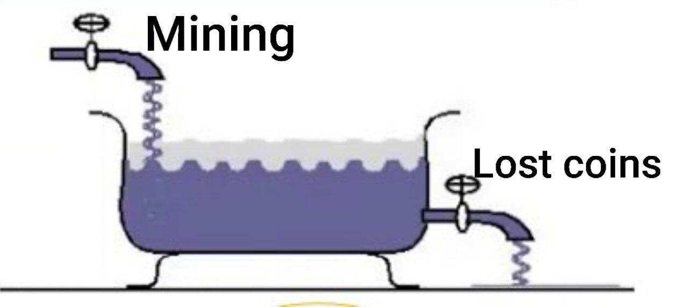

Ergon supply shrinking is a very common concern in the Ergon community, especially among newcomers. I want to address this issue here and explain my point of view.

The fact that Ergon doesn't have a **built-in**, protocol way of shrinking the supply is often the first or second observation people make. It is true - there isn't one. When the Ergon price is low, Ergon turns into a year 2140 Bitcoin, The new supply production stops. We've already been there, at one point the block reward was only around 100 fixoshi (our satoshi unit). Regardless, people say it might not be enough.

There are, however, ways it shrinks **outside the protocol**:

1. Lost coins,
2. Ergon as a consumable,
3. Fractional reserve collapses.

Let us examine them one by one.

#### Lost coins
In self custody, people are losing the coins a lot. I don't mean major, random events when someone burns their wallet with millions. At scale, **breaking phones**, **dead hard drives**, **lost pieces of paper** and so on, are a major factor, depending on the adoption and usage. It is hundreds of small events happening to everyday people. Lost coins create a constant outflow of the supply to be replenished by the miners. It is the nature of self-custody, that when something goes wrong, there is no going back, no customer support to call. Ergon is not designed to be hoarded in large quantities by the very few individuals like Bitcoin is, but to be used every day as a disposal thing.

Even I have already lost some Ergons. I know of one early miner who lost **all of his coins** from the second or third month of Ergon existence.

At scale, in a stable time, the miners will be mostly producing coins to replenish the coins that got burned. The force driving the stability will be **the difference** between what is being lost and what is being mined.

A downturn will decrease the mining and there will be more coins lost than the supply production. It's enough to just wait for the prices will return to normal. That can be arbitraged away with futures and speculators who are aware of this and effectively no price change might even happen.

#### Ergon as a consumable

There is a compelling meme, that Ergon represents a form of energy. There are ideas floating around the community to create contracts, applications or sidechains that would require you to burn the coins to use them, like you would burn the electricity, they become **electric devices**.

Those ideas weren't popular with Bitcoin, the constant supply ideology sometimes takes weird turns, making the 21M an absolutely necessary number. When the [Wormhole protocol](https://github.com/copernet/wormhole) was proposed on BCH, there was a strong opposition to the idea, so much so, that the project was eventually abandoned. There might not be the same opposition in the Ergon community, since there is no "absolute" planned amount of supply. We embrace the free market emergent supply.

For this kind of burning, the incentives are also favorable. Ergon losing value incentivizes the burning, if the application is somehow useful, leading to more burning than in the times of growth.

#### Fractional reserve collapses

Firstly, how does fractional reserve works in principle? In our story, the reserve will be 10%, but in reality it can get as low as 0.5% in trad-fi. Alice puts **$100 in the bank**. The bank will only hold $10 reserve for the Alice's deposit. They are left with free $90. That can be a reserve for an additional $900, so they lend the $900 to Bob by crediting it to his account and now the bank has a total **$1000 balance**. How come?

What in fact they are doing, is they are creating their own new, under-collateralized, pegged stablecoin, which to the external observer is indistinguishable from the real thing. They have created a new currency under the same name. The scheme goes unnoticed until a bank run happens.

The multiplication factor is the inverse of the reserve, 1/reserve. So 10% → (1/0.1)x=10x. In the example, the multiplication factor is **10x**. $100 becomes $1000. **A 1% reserve is 100x multiplication factor**.

Traditional banks have centrally regulated reserve requirements. They pay extra interest for the excess reserve. Additionally, banks rarely face the consequences of their bad decisions. In the fear of a systemic collapse, if they go bankrupt, it gets bailed out, the managers get to keep the money and their losses are socialized by the government. Bad management is rarely corrected by the market.

Austrian economists argue, that this system causes the economic cycles, by distorting the interest rates with Cantillon effect. I recommend watching this debate, it is very insightful.

<iframe style="aspect-ratio: 16/9;width:100%;max-width:560px;margin:auto;" src="https://www.youtube.com/embed/UDLCa7maGZA?si=5ds0RH98ju63sY7k" title="YouTube video player" frameborder="0" allow="accelerometer; autoplay; clipboard-write; encrypted-media; gyroscope; picture-in-picture; web-share" allowfullscreen></iframe>

As much as we'd want to believe it wasn't, **the fractional reserve system is bound to happen** on top of any cryptocurrency, because custodial services and wrapped tokens exist. At some point an exchange, a wrapped token system or a hosted wallet will start investing with the customer funds, recirculating them into the market, going fractional or lose them in a hack and not admit it. They can either stay quiet about it or be transparent and public, yet **some people won't mind**, attracted by interest offered. It will happen eventually. It might be sooner than we expect. FTX was doing this, other major exchanges are *probably* also doing it.

The bright side of this happening on Ergon instead of fiat is that:

1. There is no bail-out,
2. The reserve decisions are market-driven and meet punishment,
3. The punishment rapidly shrinks the effective supply.
4. Because the chain is functional, the events are self-contained, not systemic.

Fractional reserve collapses are analogous to M2 money supply shrinking, while the on-chain coins are M0 - cash. This is also the main mechanism for shrinking the fiat currencies. Here, the incentives are also favorable. Unsteady times make people question the liquidity of fractional entities, The entities have to predict that and either adapt by increasing their reserve (shrinking their issuance) or get run over.

#### Summary

Ergon emergent supply is a complex phenomenon, driven by many factors. My write-up is far from being exhaustive, there is a lot to think about here, but I am convinced the supply shrinking is not an issue, especially in a large adoption scenario, when all the shrinking sources are happening in tandem.

