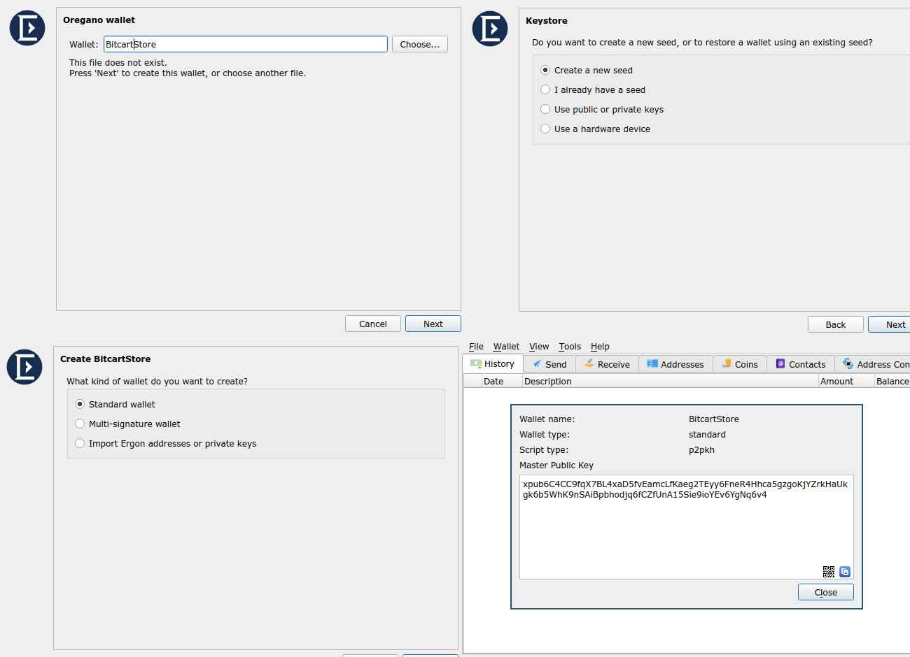
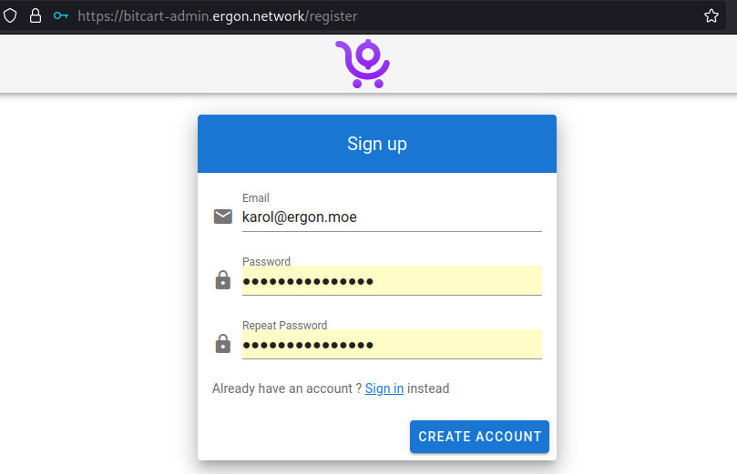
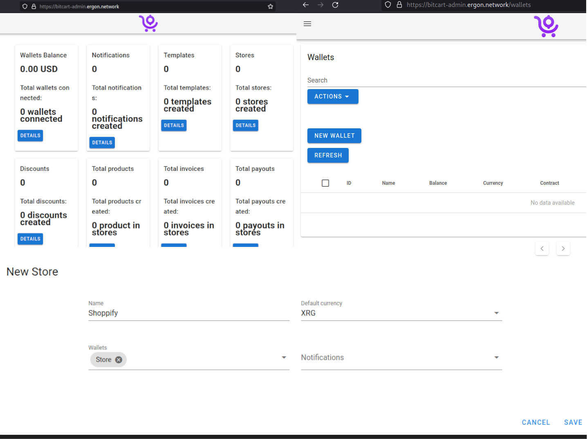

Ergon is not featured in any *mainstream* payment processor, so you might be wondering "How do I start an online business with it?".

Fortunately there is something much better. Ergon is implemented in [Bitcart](https://bitcart.ai). **Bitcart is an underrated, brilliant payment processor** that can be used as a stand-alone store or be integrated with shoppify and many ther popular e-commerce solutions. It can also serve as an SDK for things like [tipping bots](https://t.me/gonia_tipping_bot) or any other python, transaction processing apps.

Bitcart can be **self-hosted** or **third party hosted**. You can safely use a hosted option, because it doesn't have to control your private key, it only needs the wallet's Master Public Key (xpub) to operate. From the xpub, it generates unused addresses and all of the store payments go directly into a wallet, that only you control.

### How to use hosted Bitcart with Shoppify

I run a bitcart instance on ergon.network for the community to use. Let's walk through the process of setting up.

#### Setting up Oregano
First If you already use it, have a wallet, you can skip to the point 3

1. Install [Oregano Wallet](https://ergon.moe/#download) for your platform.[^1]
2. Open Oregano, you will be met with a creation wizard. Pick a name for your wallet and follow the steps in the wizard, write down the 12 words to be able to recover the wallet in case anything happens to it.
3. After you're done, in the main window, navigate to Wallet>Information or click ctrl+i. You will see the Master Public Key. It is used to generate addresses of your wallet. Leave this window open to later copy the key.

#### Setting up Bitcart
Wallet:

1. Visit the ergon.network's bitcart [admin panel](https://bitcart-admin.ergon.network/register) and fill the credentials. Hit the Create Account button.

2. Click "Detail" on the "Wallets" card.
3. Click "New Wallet".
4. Name the wallet, in the currency field pick xrg. Copy the Xpub from Oregano. You can also add a label that will appear during the payment as "Pay with: yourlabel".
5. Save.

Store:

1. Navigate back to the dashboard.
2. Click "Details" on the "Stores" card.
3. Click "New Store" button.
4. Name your store, write XRG in the "Default currency" entry, pick the wallet.
5. Save.

#### Setting up Shoppify

Now, I could be writing my own, but to be frank, Bitcart's guide on this is already great and it has a video showing how to do it.

1. From now on, [Follow this guide](https://docs.bitcart.ai/integrations/shopify). Use https://bitcart-api.ergon.network as the api link and https://bitcart-admin.ergon.network in the tutorial.

#### After completing 
After completing this tutorial you have an online store without any bank account or the need for permission from any third party. You can announce it to the passionate Ergon community that will instantly become your customers.
[^1]: Some antiviruses flagged Oregano as adware and block it, possibly because it has tor built in. You can [scan the binary](https://opentip.kaspersky.com/0A94790758459F615879D5EAF568BC59B3F85AC9D45CE59D24D8D7166D7FD6C9/results?tab=upload) yourself on the Kaspersky website and verify if it is still flagged. Oregano contains no ads, I encourage you to complain directly to the antivirus software, I've been told by other crypto software developers it helps in removing the false flagging.